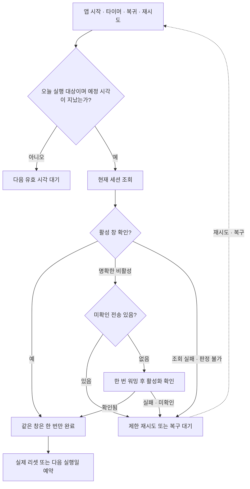

# Claude Session Warmer 사용자 흐름

갱신일: 2026-09-17. 지연 복구 상세 계약은 [09 작업계획서](09_LATE_WARMUP_RECOVERY_PLAN.md)를 따른다.

## 1. 제품 약속

예약 시각이 지난 뒤 앱 코드가 실행될 기회가 생기면 현재 세션을 확인하고 필요한 워밍 하나를 수행한다. 당일 미완료 예약을 지연 시간만으로 폐기하지 않는다. Mac 강제 깨우기와 잠자기 중 실행 보장은 제공하지 않는다.

- 첫 시각·요일·대한민국 공휴일 제외 설정을 따른다.
- 하루 최대 3개는 서로 다른 실제 활성 창을 확인한 횟수다. 이미 사용자가 활성화한 창도 포함하고 실패·지연·동일 창 재조회는 포함하지 않는다.
- 후속 예약은 서버의 실제 `five_hour.resets_at`을 사용한다. 조회 실패를 이유로 5시간 뒤의 가상 창을 만들지 않는다.
- 모든 워밍은 최소 PTY 대화형 호출을 사용한다. OAuth·Keychain 소유와 조회 어댑터는 기존 방식을 유지한다.

## 2. 최초 설정

### FLOW-001 계정 연결 (REQ-001, REQ-008, REQ-009, REQ-013)

별도 `Claude 로그인` 버튼으로 시스템 브라우저의 PKCE·loopback 인증을 수행한다. 인증 정보는 앱 전용 Keychain에 보관한다. 자동 작업은 인증 UI를 열지 않으며 필요하면 로그인을 안내한다. 로그인 성공 시 미완료 일정을 다시 판단한다.

### FLOW-002 일정 저장 (REQ-002, REQ-003)

첫 워밍 시각·요일·공휴일 제외를 draft로 편집하고 저장하면 일정을 다시 계산한다. 저장은 OAuth를 실행하지 않는다. 진행 중 작업의 결과를 먼저 반영하고 변경된 설정에 따라 다음 작업을 선택한다.

## 3. 자동 실행

### FLOW-003 현재 세션 확인과 워밍 (REQ-004, REQ-006, REQ-007)

1. 오늘이 실행일이고 하루 목표가 남았는지 확인한다.
2. 예정 시각 전이면 대기하고, 예정 시각이 지났으면 현재 세션을 조회한다.
3. 활성 창과 유효한 리셋 시각이 확인되면 호출 없이 해당 창을 완료한다.
4. 명확한 비활성이며 미확인 전송이 없을 때만 워밍한다. 조회 실패·잘못된 응답·지난 리셋 시각은 비활성으로 간주하지 않는다.
5. 호출 후 서버에서 활성화를 확인하고 완료를 저장한다. 같은 창의 1분 이내 리셋 시각 보정은 중복 집계하지 않는다.
6. 조회 도중 잠자기·시계·설정 변경이 있었으면 전송 전에 조회와 실행 자격을 다시 확인한다.

### FLOW-004 후속 예약과 하루 완료 (REQ-004, REQ-005)

확인된 실제 리셋 시각에 다음 확인을 예약한다. 같은 날 활성 창 3개를 확인하면 자동 실행을 종료한다. 리셋 시각이 다음 날이면 다음 유효 실행일의 첫 시각을 따른다.

### FLOW-005 날짜·요일·공휴일 (REQ-002, REQ-003)

새 날짜에는 그날 첫 예약과 휴일 규칙을 적용한다. 전날 미실행 예약을 순서대로 소급하지 않는다. 날짜가 바뀌어도 미확인 전송 기록은 보존한다.

### FLOW-006 이미 활성인 창 (REQ-006, REQ-007)

사용자가 먼저 사용한 경우 추가 호출을 생략한다. 같은 창 재조회·중복 이벤트는 횟수를 늘리지 않으며 실제 리셋 시각으로 다음 확인을 예약한다.

## 4. 실패와 복구

### FLOW-007 인증 문제 (REQ-008, REQ-009)

만료 임박 또는 usage 401 시 기존 managed refresh를 사용한다. 인증 복구가 필요하면 오류와 로그인 동작을 표시한다. 실패를 완료로 집계하지 않으며 로그인 성공 후 같은 미완료 일정을 재판정한다.

### FLOW-008 일시 실패·미확인 전송 (REQ-007, REQ-010)

- 조회·전송 전 일시 실패: 30초 간격으로 최초 시도 외 최대 3회 재시도한다. 대기 시각과 횟수는 재시작해도 보존한다.
- 개별 HTTP·PTY 작업은 30초 타임아웃을 유지하고, 한 시도의 전송 후 확인은 최대 60초·5회 조회로 제한한다.
- 전송됐을 수 있는 타임아웃·오류: 새 메시지 없이 상태만 확인한다. 자동 재시도 상한 후에는 오류·결과 미확인을 표시한다.
- 상한 뒤 복귀·앱 시작·로그인 완료는 미완료 작업을 다시 확인할 기회다. 실패 횟수는 초기화하지 않아 실패가 계속되면 새 반복 재시도를 만들지 않는다. 시계 변경만으로 중단 상태를 해제하지 않는다.
- `지금 워밍`은 명시적인 재시도이며 상태를 먼저 확인한다. 미확인 전송은 이 버튼만으로 해제하지 않는다.
- 사용자가 `미확인 전송을 해제하고 다시 워밍…`을 선택하고 확인하면 현재 세션을 조회한 뒤 비활성일 때만 한 번 더 보낸다.

### FLOW-009 잠자기 복귀·지연 콜백 (REQ-011)

정시 콜백과 지연 콜백은 같은 경로를 따른다. DarkWake 때 일반 복귀 알림보다 타이머가 먼저 실행될 수 있으므로 복귀 알림을 필수 조건으로 삼지 않는다. 실행 기회가 생겨도 네트워크·PTY 성공은 실제 결과로 판정한다.

### FLOW-010 앱 재시작·단일 실행 (REQ-004, REQ-007)

오늘 집계·다음 예약·재시도·미확인 전송을 복원한다. 이전 타이머 ID의 콜백은 무시한다. 이미 워밍 중이면 자동·수동·복귀 요청이 새 프로세스를 시작하지 않는다. 작업 후 필요하면 현재 일정으로 다시 판단한다.

구버전의 성공·실패 혼합 집계는 도입 당일 상한으로 보수적으로 보존하며 다음 실행일부터 새 집계를 적용한다. 이 전환일에는 목표가 조기 종료될 수 있다. 구버전에서 확인된 성공의 전송 표식은 정리하고, 결과가 불명확한 표식은 보존한다.

## 5. 사용자 제어

### FLOW-011 상태와 결과 (REQ-012)

`오늘 확인한 창`, 현재 사용량, 다음 워밍, 최근 결과를 표시한다. 재시도 대기에는 다음 시도 간격을, 중단에는 실패 이유와 복귀·수동 재시도 방법을 표시한다. 확인되지 않은 결과를 성공으로 표시하지 않는다.

### FLOW-012 로그인 실행·업데이트 (REQ-013)

macOS 로그인 시 실행 설정을 저장하고 OS 승인 필요 여부를 안내한다. 업데이트는 기존 수동 확인·서명 검증·설치 흐름을 유지하며 워밍 도중에는 시작하지 않는다.

### FLOW-013 수동 워밍 (REQ-007, REQ-012)

일정·요일·자동 횟수 검사 없이 공통 조회·중복 방지·워밍을 사용한다. 현재 미완료 자동 대상이 있으면 같은 결과로 완료한다. 일정 밖 수동 실행은 독립 실행이며 후속 자동 연쇄를 만들지 않는다.

## 6. 자동 실행 흐름도

DarkWake의 실제 워밍 완료 관찰은 사용자 담당이며 자동 회귀의 성공과 구별한다.
