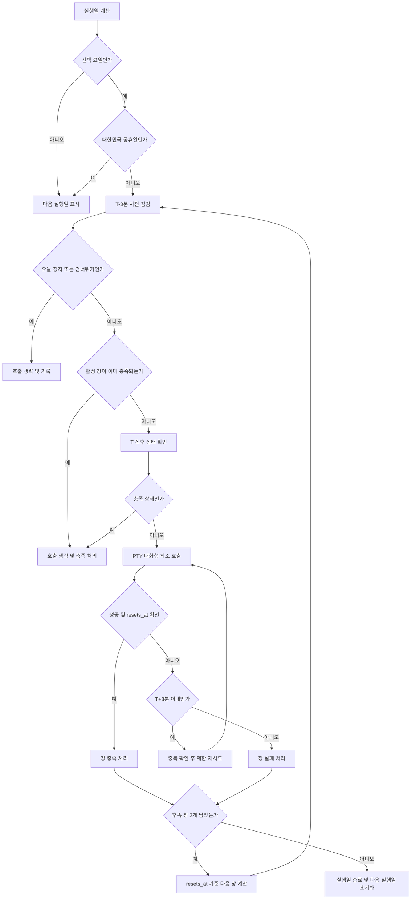

# Claude Session Warmer MVP 사용자 흐름

> 대상: 소수 내부 사용자에게 배포하는 macOS 메뉴바 앱 MVP
>
> 문서 목적: 예약 워밍, 상태 확인, 수동 제어, 예외 처리를 사용자의 관점에서 정의한다.
> 요구사항 참조: PRD `REQ-001`~`REQ-013` (각 흐름의 번호는 구현·QA 추적용 예상 참조이며, 최종 PRD와 대조한다.)

## 1. 제품 전제와 사용자에게 보이는 약속

Claude Session Warmer는 macOS 메뉴바에서 동작하며, 정해진 실행일에 Claude CLI의 대화형 세션을 최소 횟수로 워밍한다. 워밍은 `-p` 비대화형 호출이 아니라 PTY 기반의 대화형 최소 호출이어야 한다. 워밍 자체가 사용자의 대화를 대신 작성하거나 새 창의 내용을 변경하지 않는다는 것을 안내한다.

사용자는 다음 정책을 사전에 확인하고 동의한다.

- 예약은 **첫 워밍 시각 하나**와 **실행 요일**로 정한다. 대한민국 공휴일에는 실행하지 않는다.
- 한 실행일에는 첫 워밍 1회와 서버 `five_hour`의 `resets_at`을 기준으로 한 후속 2회, 총 3개 창을 목표로 한다.
- 후속 창의 시각은 고정 간격이 아니라 확인된 `resets_at`에 따라 계산한다. 다음 실행일이 되면 당일 창과 중복 방지 상태를 초기화한다.
- 각 창은 T-3분 사전 점검, T 직후 상태 확인, T부터 +3분까지만 제한 재시도를 수행한다.
- 사용자가 이미 새 창을 열어 해당 창이 충족되면 호출을 생략하고 충족 처리한다. 같은 창에 중복 호출하지 않는다.
- 잠금 화면과 디스플레이 꺼짐은 지원한다. 시스템 잠자기, 덮개 닫힘, 종료, 로그아웃으로 놓친 실행은 지원하지 않으며 catch-up하지 않는다.
- “오늘 정지”는 오늘 남은 예약을 중지한다. “다음 건너뛰기”는 다음 한 건을 건너뛰고, 다음 실제 `resets_at` 연쇄가 생기지 않으므로 그날의 남은 자동 연쇄도 종료한다. 사용자는 언제든 “수동 워밍”을 요청할 수 있다.

### 상태 표현 원칙

메뉴바 아이콘과 메뉴에는 현재 상태를 짧게 표시한다. 최소 상태는 `준비됨`, `점검 중`, `워밍 중`, `충족`, `건너뜀`, `오늘 정지`, `인증 필요`, `오류`다. 실패를 성공으로 표시하지 않으며, 마지막 결과·실패 사유·다음 실행 시각을 함께 확인할 수 있어야 한다.

## 2. 최초 실행 및 설정 흐름

### FLOW-001 최초 실행 준비 (REQ-001, REQ-008, REQ-009, REQ-010, REQ-012, REQ-013)

1. 사용자가 앱을 처음 실행하면 메뉴바 아이콘과 환영 화면을 본다.
2. 앱은 Claude CLI 경로를 자동 탐색한다. 찾지 못하면 사용자가 실행 파일 경로를 지정하고, 앱은 실행 권한과 실제 호출 가능 여부를 확인한다.
3. 앱은 `claude auth status`로 `claude.ai` 구독 인증 상태를 확인한다. 인증이 없거나 API 과금 경로이면 예약을 활성화하지 않고 사용자가 Terminal에서 인증을 바로잡도록 안내한다.
4. 기존 Claude Code 자격증명을 읽을 때 macOS Keychain 접근 승인 대화상자를 표시한다. 앱은 토큰을 복사하거나 별도 저장하지 않는다. 사용자가 거부하면 `인증 필요`로 남기고 재시도 방법을 제공한다.
5. 앱은 모델 호출 없이 CLI 실행 가능 여부, 인증 상태, Keychain 읽기, 사용량 조회 및 PTY 생성 가능 여부만 점검한다. 실제 응답을 발생시키는 PTY 검증은 배포 전 라이브 게이트에서 한 번 수행한다.
6. 준비가 모두 성공하면 사용자는 첫 워밍 시각과 실행 요일을 설정하고 저장한다. 하나라도 실패하면 원인별 안내와 “다시 확인”을 제공한다.

### FLOW-002 예약 설정 및 변경 (REQ-002, REQ-003)

사용자는 첫 워밍 시각 하나(예: 09:00)와 실행 요일(예: 월·수·금)을 선택한다. 대한민국 공휴일 제외는 기본 정책이며 이 설정은 해제할 수 없다. 저장 시 앱은 다음 실행일을 계산해 메뉴에 표시한다. 설정을 변경하면 아직 시작하지 않은 예약만 새 정책으로 계산하고, 이미 충족된 창은 다시 실행하지 않는다.

## 3. 예약 실행 정상 흐름

### FLOW-003 첫 워밍 창 (REQ-002, REQ-003, REQ-004, REQ-005, REQ-006, REQ-007, REQ-008, REQ-009, REQ-010)

실행일이 되면 앱은 첫 워밍 시각 T를 기준으로 다음 순서로 동작한다.

1. **T-3분 사전 점검**: 실행일·공휴일·오늘 정지·다음 건너뛰기·인증 상태·CLI 경로·네트워크 가능성을 확인한다. 조건이 맞지 않으면 호출하지 않고 사유를 기록한다.
2. 사용자가 T 이전에 새 창을 직접 열었고 해당 창이 활성 워밍 창의 조건을 충족하면 호출을 생략하고 `충족`으로 기록한다.
3. **T 직후 상태 확인**: 이미 충족된 창인지 다시 확인한다. 미충족이면 PTY를 열어 Claude CLI에 대화형 최소 호출을 보낸다. 비대화형 `-p` 호출은 사용하지 않는다.
4. 응답·세션 상태를 확인해 성공하면 창을 `충족`으로 확정한다. 성공 결과에는 시각, 창 식별자, 확인한 상태를 저장한다.
5. 실패 또는 상태 불명확 시 T부터 +3분까지만 제한 재시도한다. 매 재시도 전 중복 여부를 확인하고, 이미 사용자가 새 창을 열었으면 즉시 생략·충족 처리한다.
6. +3분까지 충족되지 않으면 해당 창은 `실패`로 종료한다. 이후 시간을 당겨 보충하거나 자동 catch-up하지 않는다.

### FLOW-004 후속 워밍 창 두 개 (REQ-004, REQ-005, REQ-006, REQ-007)

첫 워밍이 확인한 서버 `five_hour.resets_at`을 다음 창의 기준으로 삼는다. 앱은 서버 시각과 로컬 시각의 차이를 고려해 후속 창을 예약하고, 각 창마다 FLOW-003의 T-3분 점검·T 직후 확인·+3분 제한 재시도를 반복한다. 후속 2회까지 성공하거나 실패하면 해당 실행일의 목표 창 처리를 끝낸다. `resets_at`을 얻지 못하면 후속 창 시각을 추정해 실행하지 않고, 상태를 `오류` 또는 `재확인 필요`로 표시한다.

하루의 창 판정은 창 식별자와 실행일로 멱등 처리한다. 재시작·중복 이벤트·예약 타이머 중복이 발생해도 이미 `충족` 또는 `실패`로 확정된 창을 다시 호출하지 않는다. 다음 실행일의 첫 시작 시각에 새 일일 주기를 만들며, 이전 실행일의 사용자 제어 상태를 적용하지 않는다.

## 4. 예외 및 분기 흐름

### FLOW-005 대한민국 공휴일 또는 비선택 요일 (REQ-002, REQ-003)

예약 계산 시 실행일이 선택 요일이 아니거나 대한민국 공휴일이면 T를 만들지 않는다. 메뉴에는 `실행 없음`과 다음 실행일을 표시한다. 해당 날짜가 지난 뒤 실행일로 바뀌어도 이전 날짜 창을 catch-up하지 않는다.

### FLOW-006 이미 활성 창이 있는 경우 (REQ-005, REQ-006, REQ-007)

사전 점검 또는 T 직후 확인에서 사용자가 이미 새 창을 연 사실을 확인하면 CLI 호출을 생략한다. 앱은 해당 창이 워밍 조건을 충족하는지 확인한 뒤 `충족(사용자 창)`으로 기록한다. 이미 앱이 처리한 창 또는 같은 창 식별자를 발견하면 어떠한 추가 호출도 하지 않는다.

### FLOW-007 인증·Keychain 오류 (REQ-008, REQ-009, REQ-012)

구독 인증 만료, CLI 인증 실패, Keychain 접근 거부가 발생하면 워밍을 시작하지 않는다. 메뉴바는 `인증 필요`를 표시하고, 사용자가 “인증 다시 하기”를 선택할 때까지 예약 호출을 보류한다. 인증을 회복해도 놓친 창을 소급 실행하지 않으며, 다음 유효한 실행 창부터 재개한다.

### FLOW-008 네트워크·CLI 오류 (REQ-007, REQ-008, REQ-010, REQ-012)

네트워크 단절, CLI 경로 변경, PTY 생성·응답·종료 상태 판정 실패 시 민감정보를 제외한 오류 분류와 종료 상태만 로컬 결과에 남긴다. T~+3분 안에서는 제한 재시도하되, 재시도마다 새 호출 여부와 중복 방지를 확인한다. +3분 이후에는 `실패`로 확정하고 자동 재시도하지 않는다.

### FLOW-009 잠금·디스플레이 꺼짐과 미지원 절전 상태 (REQ-011)

화면 잠금 또는 디스플레이 꺼짐 중에도 앱과 예약 실행이 가능한 경우 정상 처리한다. 반면 시스템 잠자기, 덮개 닫힘, 종료, 로그아웃으로 프로세스가 실행되지 못한 경우 해당 창은 놓친 것으로 간주한다. 깨어난 뒤 즉시 실행하는 catch-up은 하지 않고, 메뉴에 `놓침`과 다음 실행을 표시한다.

### FLOW-010 앱 재시작 (REQ-004, REQ-005, REQ-007, REQ-011, REQ-012)

앱 재시작 시 저장된 실행일·창 식별자·상태·`resets_at`·마지막 결과를 복원한다. 이미 처리된 창은 다시 호출하지 않는다. +3분 이후에는 catch-up하지 않는다. +3분 이내라도 재시작 전에 이미 시작된 제한 재시도만 이어가며, 한 번도 시작하지 못한 과거 예약을 새로 실행하지 않는다.

## 5. 메뉴바 및 수동 제어 흐름

### FLOW-011 메뉴바 현재 상태 확인 (REQ-005, REQ-008, REQ-012)

메뉴바를 열면 다음 항목을 한 화면에서 확인한다.

- 현재 상태: 준비됨/점검 중/워밍 중/충족/오류 등
- 다음 실행: 날짜·시각·창 순번
- 현재 reset: 서버 `five_hour.resets_at`과 마지막 확인 시각
- 오늘 정지
- 다음 건너뛰기
- 수동 워밍
- 최근 결과: 최근 성공·생략·실패·놓침과 사유

`현재 reset`이 오래되었거나 확인되지 않은 경우 “확인 필요”로 표시하며 확정된 시각처럼 보이지 않게 한다.

### FLOW-012 오늘 정지 및 다음 건너뛰기 (REQ-004, REQ-007, REQ-012)

“오늘 정지” 선택 시 앱은 확인을 받은 뒤 오늘 남은 미시작 창을 모두 중지한다. 이미 워밍 중인 호출은 중단하지 않고 결과를 기록한다. “다음 건너뛰기”는 가장 가까운 미시작 창 하나를 건너뛴다. 새 창을 열지 않으면 다음 실제 `resets_at`이 생기지 않으므로 그 실행일의 남은 자동 연쇄도 종료된다는 점을 확인 문구로 안내한다. 두 제어의 적용 범위는 다음 실행일의 첫 시작 시각에 끝난다.

### FLOW-013 수동 워밍 (REQ-004, REQ-007, REQ-008, REQ-010, REQ-012)

사용자가 “수동 워밍”을 선택하면 현재 인증·CLI·네트워크 상태와 이미 활성 창 여부를 점검한다. 활성 창이 있으면 호출을 생략한다. 활성 일일 주기 중 새 창을 실제로 열면 다음 미처리 창을 충족한 것으로 계산하고 실제 `resets_at`으로 후속 일정을 갱신한다. 일일 주기 밖에서 실행한 수동 워밍은 한 번의 독립 실행으로 끝나며 후속 자동 연쇄를 시작하지 않는다. 실패 시 예약을 임의로 앞당기거나 재계산하지 않는다.

## 6. Mermaid 정상 흐름

## 7. 상태 전이 표

| 현재 상태 | 이벤트/조건 | 다음 상태 | 사용자에게 보이는 의미 |
|---|---|---|---|
| 미예약 | 설정 저장 | 예약됨 | 다음 실행이 계산됨 |
| 예약됨 | T-3분 도달 | 점검 중 | 사전 조건을 확인 중 |
| 점검 중 | 공휴일/비선택 요일 | 건너뜀 | 오늘 실행 없음 |
| 점검 중 | 오늘 정지/다음 건너뛰기 | 건너뜀 | 사용자 제어로 생략 |
| 점검 중 | 활성 창 충족 | 충족 | 호출 없이 사용자 창으로 충족 |
| 점검 중 | 조건 통과, T 도달 | 확인 중 | 직전 상태를 재확인 중 |
| 확인 중 | 이미 충족 | 충족 | 중복 호출 없음 |
| 확인 중 | 미충족 | 워밍 중 | PTY 대화형 호출 진행 |
| 워밍 중 | 성공 | 충족 | 창 처리 완료 |
| 워밍 중 | 오류, +3분 이내 | 재시도 대기 | 제한된 재시도 예정 |
| 재시도 대기 | 재시도 성공 | 충족 | 창 처리 완료 |
| 재시도 대기 | +3분 초과 | 실패 | 이번 창은 종료 |
| 예약됨/점검 중 | 인증·Keychain 오류 | 인증 필요 | 인증 회복 전 보류 |
| 예약됨/점검 중 | 절전·종료로 실행 불가 | 놓침 | catch-up하지 않음 |
| 충족/실패/놓침 | 다음 실행일 시작 | 예약됨 | 새 실행일로 초기화 |

## 8. 배포 전 검증 게이트

라이브 anchor 검증은 배포 전 필수 게이트다(REQ-005, REQ-007, REQ-008, REQ-009, REQ-010). 실제 내부 배포 환경에서 Claude CLI 경로, `claude.ai` 구독 인증, Keychain 승인, PTY 대화형 최소 호출, 서버 `five_hour.resets_at`, 활성 창 생략, 중복 방지, 메뉴바 상태 갱신을 확인해야 한다. 화면 잠금·디스플레이 꺼짐과 지원하지 않는 잠자기·덮개·종료·로그아웃의 동작 차이도 각각 검증한다. 게이트 결과가 없으면 앱의 예약 흐름을 “검증 완료”로 표시하거나 배포 완료로 간주하지 않는다.
