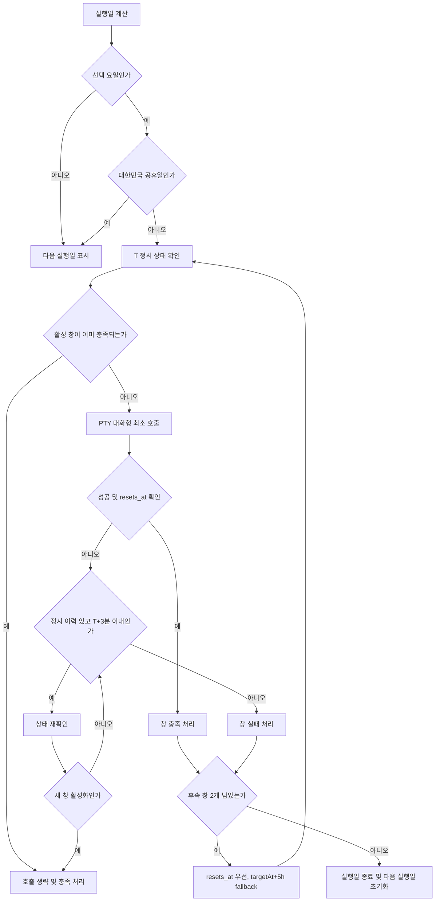

# Claude Session Warmer MVP 사용자 흐름

> 대상: 소수 내부 사용자에게 배포하는 macOS 메뉴바 앱 MVP
>
> 문서 목적: 예약 워밍, 상태 확인, 수동 제어, 예외 처리를 사용자의 관점에서 정의한다.
> 요구사항 참조: PRD `REQ-001`~`REQ-013` (각 흐름의 번호는 구현·QA 추적용 예상 참조이며, 최종 PRD와 대조한다.)

## 1. 제품 전제와 사용자에게 보이는 약속

Claude Session Warmer는 macOS 메뉴바에서 동작하며, 정해진 실행일에 Claude CLI의 대화형 세션을 최소 횟수로 워밍한다. 워밍은 `-p` 비대화형 호출이 아니라 PTY 기반의 대화형 최소 호출이어야 한다. 워밍 자체가 사용자의 대화를 대신 작성하거나 새 창의 내용을 변경하지 않는다는 것을 안내한다.

사용자는 다음 정책을 사전에 확인하고 동의한다.

- 예약은 **첫 워밍 시각 하나**와 **실행 요일**로 정한다. 대한민국 공휴일 제외는 기본으로 켜져 있고 사용자가 변경할 수 있다.
- 한 실행일에는 첫 워밍 1회와 서버 `five_hour`의 `resets_at`을 기준으로 한 후속 2회, 총 3개 창을 목표로 한다.
- 후속 창은 확인된 `resets_at`을 우선 사용하고, 없으면 실패·놓침의 `targetAt + 5시간`으로 계산한다. 다음 실행일이 되면 당일 창과 중복 방지 상태를 초기화한다.
- 각 창은 T 전에는 아무 동작도 하지 않고, T 정시 시도 이력이 있는 확인 또는 첫 시도 실패에만 T부터 +3분까지 제한 재시도한다.
- 사용자가 이미 새 창을 열어 해당 창이 충족되면 호출을 생략하고 충족 처리한다. 같은 창에 중복 호출하지 않는다.
- 잠금 화면과 디스플레이 꺼짐은 지원한다. 시스템 잠자기, 덮개 닫힘, 종료, 로그아웃으로 놓친 실행은 지원하지 않으며 catch-up하지 않는다.
- 사용자는 언제든 “수동 워밍”을 요청할 수 있다.
- 앱은 하나의 Claude.ai 계정만 관리한다. 다중 계정·계정 전환·앱 내 로그아웃은 제공하지 않는다.

### 상태 표현 원칙

메뉴바 아이콘과 메뉴에는 현재 상태를 짧게 표시한다. 최소 상태는 `준비됨`, `점검 중`, `워밍 중`, `충족`, `인증 필요`, `오류`다. 실패를 성공으로 표시하지 않으며, 마지막 결과·실패 사유·다음 실행 시각을 함께 확인할 수 있어야 한다.

## 2. 최초 실행 및 설정 흐름

### FLOW-001 최초 실행 준비 (REQ-001, REQ-008, REQ-009, REQ-010, REQ-012, REQ-013)

1. 사용자가 앱을 처음 실행하면 메뉴바 아이콘, 일정 설정과 별도의 `Claude 로그인` 동작을 본다.
2. 일정 `저장`은 시각·요일·공휴일·로그인 실행 설정만 적용하고 OAuth나 Keychain 승인을 시작하지 않는다.
3. 사용자가 `Claude 로그인`을 선택하면 앱은 기존 기본 Claude Code credential을 임시 보관하고 `claude auth login --claudeai`를 실행해 브라우저 로그인을 위임한다.
4. 승인된 로그인 결과의 access token·회전형 refresh token·expiry를 앱 전용 Keychain에 `AfterFirstUnlockThisDeviceOnly`로 저장하고, 기존 기본 credential을 성공·실패와 관계없이 원상복구한다.
5. 메뉴를 열면 앱 managed credential로 로그인 상태와 사용량을 자동 확인한다. 실제 응답을 발생시키는 PTY 검증은 배포 전 라이브 게이트에서 별도로 수행한다.

### FLOW-002 예약 설정 및 변경 (REQ-002, REQ-003)

사용자는 첫 워밍 시각 하나(예: 09:00), 실행 요일(예: 월·수·금), 대한민국 공휴일 제외 여부를 draft로 선택한다. `저장` 전에는 기존 예약을 유지하며, 저장 시 다음 실행일만 다시 계산한다. Claude 로그인 상태는 저장과 독립적이다.

## 3. 예약 실행 정상 흐름

### FLOW-003 첫 워밍 창 (REQ-002, REQ-003, REQ-004, REQ-005, REQ-006, REQ-007, REQ-008, REQ-009, REQ-010)

실행일이 되면 앱은 첫 워밍 시각 T를 기준으로 다음 순서로 동작한다.

1. **T 정시 상태 확인**: 실행일·공휴일·managed 인증 상태·CLI 경로·네트워크와 이미 충족된 창을 확인한다. access token이 만료 임박이면 UI 없이 앱 refresh token으로 갱신한다. 활성 창이면 호출 없이 `충족`으로 기록한다.
2. 미충족이면 PTY를 열어 Claude CLI에 대화형 최소 호출을 한 번 보낸다. 비대화형 `-p` 호출은 사용하지 않는다.
3. 응답·세션 상태를 확인해 성공하면 창을 `충족`으로 확정한다. 성공 결과에는 시각, 창 식별자, 확인한 상태를 저장한다.
4. 정시 시도 이력이 있는 실패 또는 상태 불명확 시에만 T부터 +3분까지 상태를 재확인한다. 메시지 전송 가능성이 있으면 모델 호출은 재시도하지 않는다.
5. +3분까지 충족되지 않으면 해당 창은 `실패`로 기록하고, 실제 `resets_at`이 없으면 `targetAt + 5시간` fallback으로 다음 창을 예약한다. 이전 시간을 소급하지 않는다.

### FLOW-004 후속 워밍 창 두 개 (REQ-004, REQ-005, REQ-006, REQ-007)

첫 워밍이 확인한 서버 `five_hour.resets_at`을 다음 창의 기준으로 우선 삼는다. 없으면 직전 실패·놓침 `targetAt + 5시간`을 사용한다. 각 창마다 FLOW-003의 T 정시 확인·+3분 제한 재시도를 반복하며, 세 번째 처리 뒤 그 실행일을 끝낸다.

하루의 창 판정은 창 식별자와 실행일로 멱등 처리한다. 재시작·중복 이벤트·예약 타이머 중복이 발생해도 이미 `충족` 또는 `실패`로 확정된 창을 다시 호출하지 않는다.

## 4. 예외 및 분기 흐름

### FLOW-005 대한민국 공휴일 또는 비선택 요일 (REQ-002, REQ-003)

예약 계산 시 실행일이 선택 요일이 아니거나, 공휴일 제외가 켜진 상태에서 대한민국 공휴일이면 T를 만들지 않는다. 메뉴에는 `실행 없음`과 다음 실행일을 표시한다. 해당 날짜가 지난 뒤 실행일로 바뀌어도 이전 날짜 창을 catch-up하지 않는다.

### FLOW-006 이미 활성 창이 있는 경우 (REQ-005, REQ-006, REQ-007)

T 정시 확인 또는 제한 재확인에서 사용자가 이미 새 창을 연 사실을 확인하면 CLI 호출을 생략한다. 앱은 해당 창이 워밍 조건을 충족하는지 확인한 뒤 `충족(사용자 창)`으로 기록한다. 이미 앱이 처리한 창 또는 같은 창 식별자를 발견하면 어떠한 추가 호출도 하지 않는다.

### FLOW-007 인증·Keychain 오류 (REQ-008, REQ-009, REQ-012)

자동 예약은 앱 전용 managed credential만 UI 없이 읽는다. 만료 임박 시 한 번만 refresh하고, usage 401이면 refresh 후 한 번만 재시도한다. 회전된 refresh token과 새 access token·expiry는 함께 저장한다. 만료·refresh 실패·credential 부재면 해당 창을 실패 처리해 다음 2·3번째 창은 fallback으로 유지하고, 잠금 해제 후 `Claude 로그인`을 다시 수행하도록 안내한다.

### FLOW-008 네트워크·CLI 오류 (REQ-007, REQ-008, REQ-010, REQ-012)

네트워크 단절, CLI 경로 변경, PTY 생성·응답·종료 상태 판정 실패 시 민감정보를 제외한 오류 분류와 종료 상태만 로컬 결과에 남긴다. T~+3분 안에서는 상태를 재확인하며, 메시지 송신 전 실패로 확인된 경우에만 PTY 호출을 재시도한다. +3분 이후에는 해당 창을 `실패`로 확정하고 fallback으로 다음 창을 예약한다.

### FLOW-009 잠금·디스플레이 꺼짐과 미지원 절전 상태 (REQ-011)

화면 잠금 또는 디스플레이 꺼짐 중에도 앱과 예약 실행이 가능한 경우 정상 처리한다. 반면 T 이후 앱 시작·절전 복귀 등 정시 시도 이력이 없는 창은 PTY 없이 `missed`로 기록하고 fallback 다음 실행을 표시한다.

### FLOW-010 앱 재시작 (REQ-004, REQ-005, REQ-007, REQ-011, REQ-012)

앱 재시작 시 저장된 실행일·창 식별자·정시 시도 이력·상태·`resets_at`·마지막 결과를 복원한다. 정시 이력 없는 과거 예약은 PTY 없이 `missed` 처리하고, 이미 시작된 제한 재시도만 +3분 안에서 이어간다.

## 5. 메뉴바 및 수동 제어 흐름

### FLOW-011 메뉴바 현재 상태 확인 (REQ-005, REQ-008, REQ-012)

메뉴바를 열면 다음 항목을 한 화면에서 확인한다.

- 상태 card, 오늘 처리·사용량 metric cards, 다음 실행·리셋 schedule card
- 전체 폭 `지금 워밍`, 별도 `Claude 로그인`과 설정 `저장`
- 최근 결과: 최근 성공·생략·실패·놓침과 사유

`현재 reset`이 오래되었거나 확인되지 않은 경우 “확인 필요”로 표시하며 확정된 시각처럼 보이지 않게 한다.

### FLOW-012 설정 저장 (REQ-002, REQ-012)

사용자는 draft 설정을 검토한 뒤 `저장`으로만 예약을 재계산한다. 저장은 Claude 로그인·토큰 갱신·Keychain 승인을 수행하지 않는다.

### FLOW-013 수동 워밍 (REQ-004, REQ-007, REQ-008, REQ-010, REQ-012)

사용자가 “수동 워밍”을 선택하면 현재 인증·CLI·네트워크 상태와 이미 활성 창 여부를 점검한다. 최근 3분 내 메시지 전송 가능 이력이 있으면 모델을 재호출하지 않고 상태만 확인한다. 활성 일일 주기 중 새 창을 실제로 열면 다음 미처리 창을 충족한 것으로 계산하고 실제 `resets_at`으로 후속 일정을 갱신한다. 일일 주기 밖에서 실행한 수동 워밍은 한 번의 독립 실행으로 끝난다.

## 6. Mermaid 정상 흐름

## 7. 상태 전이 표

| 현재 상태 | 이벤트/조건 | 다음 상태 | 사용자에게 보이는 의미 |
|---|---|---|---|
| 미예약 | 설정 저장 | 예약됨 | 다음 실행이 계산됨 |
| 예약됨 | T 도달 | 점검 중 | 상태와 실행 조건을 확인 중 |
| 점검 중 | 활성 창 충족 | 충족 | 호출 없이 사용자 창으로 충족 |
| 점검 중 | 미충족 | 워밍 중 | PTY 대화형 호출 진행 |
| 워밍 중 | 성공 | 충족 | 창 처리 완료 |
| 워밍 중 | 오류, +3분 이내 | 재시도 대기 | 제한된 재시도 예정 |
| 재시도 대기 | 재시도 성공 | 충족 | 창 처리 완료 |
| 재시도 대기 | +3분 초과 | 실패 | fallback으로 다음 창 예약 |
| 예약됨/점검 중 | 만료·refresh·managed Keychain 오류 | 인증 필요 | 이번 창 실패, fallback 유지, 잠금 해제 후 Claude 로그인 안내 |
| 예약됨/점검 중 | 절전·종료로 실행 불가 | 놓침 | catch-up 없이 fallback 예약 |
| 충족/실패/놓침 | 다음 실행일 시작 | 예약됨 | 새 실행일로 초기화 |

## 8. 배포 전 검증 게이트

라이브 anchor 검증은 배포 전 필수 게이트다(REQ-005, REQ-007, REQ-008, REQ-009, REQ-010). 실제 내부 배포 환경에서 CLI 로그인 위임, 기본 credential 원상복구, 앱 Keychain 저장·회전 refresh, PTY 대화형 최소 호출, 서버 `five_hour.resets_at`, 활성 창 생략, 중복 방지와 메뉴바 상태를 확인해야 한다. 화면 잠금·디스플레이 꺼짐과 지원하지 않는 잠자기·덮개·종료·로그아웃의 동작 차이도 각각 검증한다. 게이트 결과가 없으면 앱의 예약 흐름을 “검증 완료”로 표시하거나 배포 완료로 간주하지 않는다.
