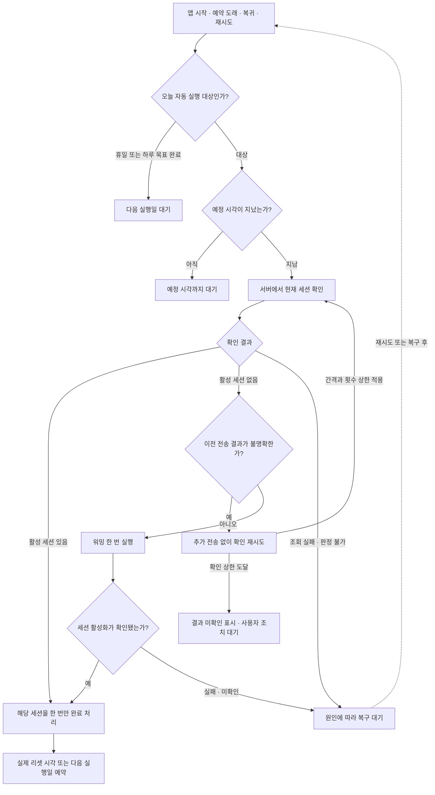

# 지연된 예약 워밍 복구 작업계획서

작성일: 2026-09-17 (Asia/Seoul)

상태: 구현 진행 중. 2026-09-17 사용자 지시에 따라 origin/dev 기준 codex/fix-late-warmup-recovery 브랜치에서 진행한다. 구현·자동 검증·단계별 커밋/푸시를 1시간 내 완료하는 것이 목표다.

기준 코드: `61037b30d93c8761755caf2a7dd5ebf47db140f5`

진행 방식: 서브에이전트 없이 단일 에이전트가 순서대로 수행한다.

## 1. 목표

**예약 시각이 지난 뒤 실행 기회가 생기면, 현재 세션을 확인하고 필요한 워밍 하나를 수행한다.**

예약 시각은 실행을 시작할 수 있는 기준이다. 5초 또는 3분 늦었다는 이유로 미처리 작업을 폐기하지 않는다. 타이머 콜백, 앱 시작, 잠자기 복귀가 같은 판단 경로를 사용한다.

여러 예약을 놓쳤더라도 과거 예약을 차례로 실행하지 않는다. 현재 필요한 작업 하나를 처리하고, 서버에서 확인한 실제 리셋 시각으로 후속 일정을 정한다.

## 2. 이번 장애와 기존 설계의 문제

관찰 설치본은 0.1.4 빌드 9다. 다음은 2026-09-17 한국 시간 기준 실제 기록이다.

| 시각 | 관찰 사실 |
| --- | --- |
| 05:47:26 | macOS가 `Maintenance Sleep` 진입 |
| 06:00:00 | 첫 예약 시각. 시스템은 잠자기 상태 |
| 06:02:26.773 | `timer.callback` 도착. 예약 대비 146.773초 지연 |
| 06:02:27 | macOS에 `DarkWake` 기록 |
| 06:02:27.051 | `timer.fired`. 콜백 이후 MainActor 전달 지연 278ms |
| 06:02:27.073 | `window.unresolved`, 결과 `missed` |

앱 로그: `~/Library/Logs/ClaudeSessionWarmer/events.jsonl`, `launch_id=9FE181BF-F083-4D22-80F5-77498DCABB60`, sequence 185~187, `timer_id=F94DAF20-B8B9-4E06-9ED2-BBB98D7DE67F`. 전원 기록은 같은 날짜의 `pmset -g log`와 대조했다.

시스템 잠자기가 콜백을 지연시켰고, 이후 앱의 최초 실행 5초 제한이 워밍 시도를 차단했다. 그때 워밍을 시도했다면 성공했을지는 확인되지 않았다. 로그 기록 가능과 네트워크·PTY 워밍 완료 가능은 별도로 검증한다.

현재 코드에서 함께 바꿔야 할 부분은 다음과 같다.

| 위치 | 기존 동작 | 변경 이유 |
| --- | --- | --- |
| `AppState.handle` | 최초 처리가 목표보다 5초 늦으면 `closeMissed` | 실행 기회가 생겨도 시도하지 않음 |
| `ScheduleEngine.position`, `nextEvent` | 목표에서 3분 지난 예약을 만료로 제외 | 콜백 조건 하나만 고쳐도 시작·복귀 경로는 계속 예약을 버림 |
| `AppState.reconcileMissedWindows`, `reconcilePendingSchedule` | 지난 예약을 놓침으로 확정 | 재시작·복귀 때 같은 문제가 반복됨 |
| `checkSession`, `handleTargetFailure` | 원래 목표의 T+3분으로 전송·확인·재시도 제한 | 늦게 시작한 정상 작업도 바로 마감될 수 있음 |
| `advanceAfterUnresolvedWindow` | 놓침·실패로 횟수 증가, `targetAt + 5시간` 예약 | 실제 세션이 생성되지 않아도 하루 목표를 소진함 |
| `hasStartedEvent`, `shouldSuppressWarmup` | 동일한 3분 상수를 실행 이력·중복 판정에도 사용 | 상수의 일괄 삭제가 중복 호출 방지를 훼손할 수 있음 |

기존 [예약 시계 수정 계획](06_SCHEDULER_WALL_CLOCK_FIX_PLAN.md)의 실제 시각 타이머, 취소된 콜백 무시, 진단 로그는 유지한다. 최초 5초·재시도 T+3분·놓침 후 fallback 정책은 이번 계획으로 대체한다.

## 3. 변경할 동작 계약

### 3.1 실행 조건과 날짜 경계

1. 자동 실행은 선택 요일·공휴일 설정에 맞는 오늘을 대상으로 한다.
2. 오늘 첫 예약 또는 확인된 후속 리셋 시각 전에는 기다린다.
3. 예정 시각이 지났고 하루 목표가 남아 있으면 현재 세션을 확인한다. 지연 시간으로 실행 자격을 없애지 않는다.
4. 여러 시간을 놓쳐도 처리 대상은 현재 필요한 작업 하나다. 놓친 시각마다 워밍하거나 횟수를 증가시키지 않는다.
5. 날짜가 바뀌면 오늘의 설정과 첫 예약 시각을 적용한다. 전날 미실행 예약은 이월 실행하지 않는다.
6. 다음 리셋이 다음 날이면 그 시각에 전날 후속 작업을 실행하지 않고 다음 유효 실행일의 첫 예약을 따른다.
7. 날짜 경계는 자동 일정의 자격을 바꾸지만, 진행 중이거나 전송 결과가 불명확한 작업의 중복 방지 기록을 삭제하지 않는다.
8. 조회 도중 설정·날짜가 바뀌거나 잠자기를 거친 경우, 실제 전송 직전에 현재 실행 자격과 조회 결과의 유효성을 다시 확인한다. 오래된 비활성 응답만으로 전송하지 않는다.

### 3.2 하루 최대 3개 창의 의미

이번 설계에서는 **자동 일정이 서로 다른 실제 사용량 창을 확인한 횟수**를 하루 최대 3개로 집계한다.

- 워밍 후 활성화 확인: 해당 창 1개 완료.
- 사용자가 이미 활성화한 창 확인: 추가 호출 없이 해당 창 1개 완료.
- 같은 창 재조회·복귀 알림·앱 재시작: 추가 집계 없음.
- 실패·잠자기·일정 지연: 완료 횟수 증가 없음.
- 3개 확인 후: 다음 유효 실행일까지 자동 워밍 종료.

이는 기존의 성공·실패·놓침을 모두 포함한 `handledWindows` 정책을 바꾸는 내용이다. 기존 필드의 이름만 바꾸거나 그대로 성공 횟수로 읽어서는 안 된다.

서버가 제공하는 창 정보와 저장된 완료 기록으로 같은 창을 식별한다. 명시적인 창 ID가 없는 현재 응답에서 `resets_at`을 어떻게 비교할지, 미세한 시각 보정을 새 창으로 오인하지 않는지는 TASK-01에서 기존 응답·테스트를 기준으로 정한다.

### 3.3 다음 실행과 수동 워밍

- 활성 창의 실제 `resets_at`을 얻으면 남은 횟수·실행일 규칙에 맞춰 다음 예약을 만든다.
- 사용량 또는 리셋 시각을 확인하지 못하면 조회 복구 대상으로 둔다. 원래 예약에 5시간을 더해 가상의 다음 창을 만들지 않는다.
- 수동 워밍은 요일·첫 시각·자동 목표 횟수 검사 없이 공통 세션 확인 흐름에 들어간다.
- 수동·자동 요청이 겹치면 하나의 진행 작업을 공유한다. 자동 일정에서 현재 처리할 대상과 겹친 경우에만 같은 결과로 자동 대상도 완료한다.
- 일정 밖 수동 워밍은 독립 실행이며 새 자동 연쇄를 시작하지 않는다.

## 4. 재구성한 흐름도

아래는 자동 실행 흐름이다. 수동 요청은 `서버에서 현재 세션 확인`부터 진입하되 단일 실행과 중복 방지 규칙을 공유한다.



모든 진입은 하나의 실행 조정 경로를 통과한다. 이미 작업 중이면 추가 프로세스를 시작하지 않고 재판정 요청을 합친다. 결과를 저장한 뒤 현재 설정으로 한 번만 재판정한다. 조회 결과는 `활성`, `확인된 비활성`, `판정 불가`를 구분한다.

DarkWake에서 지연된 타이머 콜백이 실행될 수도 있으므로 `system_wake` 알림만을 기다리는 구조로 만들지 않는다. 이번 기록에서도 콜백과 일반 복귀 알림의 시각이 달랐다.

## 5. 실패·재시도·결과 불명확 처리

예약 지연에는 만료를 두지 않는다. 개별 작업이 끝없이 실행되지 않도록 하는 타임아웃과 재시도 상한은 별도로 둔다.

| 상태 | 처리 | 재개 조건 |
| --- | --- | --- |
| 사용량 조회의 일시적 실패 | 새 메시지를 보내지 않고 간격을 둔 제한 재시도 | 재시도 타이머, 이후 복귀 또는 사용자 재시도 |
| CLI 실행·전송 전에 실패했음이 확인됨 | 같은 미완료 작업으로 제한 재시도 | 재시도 타이머 또는 원인 해결 |
| 전송됐을 수 있으나 결과 미확인 | 추가 전송 없이 상태 조회만 재시도 | 활성화 확인 또는 명시적 사용자 조치 |
| 인증 갱신 불가·재로그인 필요 | 자동 로그인 UI를 열지 않고 원인 표시 | 사용자 로그인 성공 후 재판정 |
| CLI 경로·설치 문제 | 원인 표시, 반복 호출 중지 | 수정 후 사용자 재시도 |
| 연속 재시도 상한 도달 | 미완료·실패 이유 보존, 자동 반복 중지 | 이후 복귀, 앱 시작 또는 명시적 재시도에서 자격 재판정 |

구현 기본안은 기존 HTTP·PTY 작업별 30초 타임아웃과 결과 확인 최대 60초를 재사용하고, 전송 전 일시 오류는 최초 시도 외 최대 3회, 30초 간격으로 재시도하는 것이다. 이 값은 이번 장애의 원인으로 확인된 값이 아니라 구현·검증할 운영 기본안이다. 필요한 경우 TASK-03 검증 결과에 따라 문서와 함께 조정한다.

제한은 원래 예약 T+3분이 아니라 실제 작업의 시도 횟수와 개별 실행 시간을 기준으로 적용한다. 재시도 대기 중 추가 알림이 와도 대기 시각을 앞당기거나 횟수를 초기화하지 않는다. 재시작으로 자동 재전송 상한이 초기화되지 않도록 필요한 상태를 저장한다.

전송 여부가 불명확한 상태는 시간이 지났다는 이유나 앱 재시작만으로 해제하지 않는다. 확인 상한 이후에는 `결과 미확인`을 표시한다. 수동 버튼도 이 중복 방지 상태를 무시해 바로 다시 보내서는 안 된다. 명시적 재전송이 필요한 경우의 사용자 동작과 안내는 TASK-03에서 함께 구체화한다.

## 6. 구현 순서

### TASK-01 — 상태와 구버전 기록 전환

대상: `Models.swift`, `SettingsStore.swift`, `SettingsStoreTests.swift`

- 오늘 확인한 창, 다음 실행 시각, 미완료 작업, 전송 가능 이력을 구별하는 최소 상태를 정한다. 범용 작업 큐나 별도 저장소는 만들지 않는다.
- 실제 전송 시각과 원래 예약 시각을 구별한다. 지연된 작업의 중복 방지를 과거 `targetAt` 근처 3분에만 의존하지 않는다.
- 완료 창을 중복 집계하지 않는 기준을 정하고 저장·복원한다.
- 구버전 `DailyCycle`을 읽을 수 있게 하며 새 필드가 없다고 전체 상태를 초기화하지 않는다. 원래 설정과 전송 가능 이력을 보존한다.
- 구버전 당일 `handledWindows`에는 성공·실패가 섞여 있으므로 정확한 성공 횟수를 임의 복원하지 않는다. 전환 기본안은 기존 집계를 당일 상한 계산용으로 보수적으로 보존하고 다음 실행일부터 새 집계를 적용하는 것이다. 이 경우 도입 당일 목표가 조기 종료될 수 있다는 한시적 제약을 기록한다. 구현 전 fixture와 실제 저장 형태를 대조해 최종 전환 규칙을 확정한다.

완료 기준: 구버전 상태를 읽어도 추가 중복 전송·하루 상한 초기화·인증 및 일정 설정 소실이 없고, 전환 규칙이 테스트로 고정된다.

### TASK-02 — 지연 실행과 일정 계산 통합

대상: `ScheduleEngine.swift`, `AppState.swift`, 필요 시 `DiagnosticLogger.swift`

- 최초 5초 초과 폐기와 예약 T+3분 만료를 제거한다.
- `scheduleNext`, `reconcilePendingSchedule`, `handle`, 앱 초기화에서 같은 현재 실행 자격을 적용한다.
- `reconcileMissedWindows`의 놓침 집계 및 연쇄 fallback을 새 흐름으로 대체한다.
- 실패·놓침의 `targetAt + 5시간` fallback을 제거하고 실제 리셋 또는 미완료 작업의 복구를 예약한다.
- 기존 `WallClockTimer`의 wall time 예약과 타이머 ID에 따른 이전 콜백 무시를 유지한다.
- 조기 콜백은 예정 시각까지 다시 대기하고, 지연 콜백은 현재 상태 확인으로 진행한다.
- 날짜·요일·공휴일·설정 변경과 실행 중 재판정 경합을 처리한다.

완료 기준: T+147초와 T+3시간의 타이머·복귀·앱 시작 모두 동일한 조회 경로에 진입하고, 과거 예약을 반복 실행하지 않는다.

### TASK-03 — 공통 워밍·실패 복구·수동 실행

대상: `AppState.swift`, `ClaudeService.swift` 중 전송 결과 판별 부분, `MenuContent.swift`

- `checkSession`의 원래 예약 기준 마감을 제거하고 작업별 타임아웃·확인 상한으로 분리한다.
- `hasStartedEvent`, `shouldSuppressWarmup`의 시간 기반 추정을 저장된 작업·전송 상태와 맞춘다. 3분 상수의 모든 참조를 목적별로 점검한다.
- 조회 실패와 전송 전 실패, 전송 후 미확인을 구분한다. 프로세스 종료 코드만으로 미전송을 단정하지 않는다.
- 자동·수동 워밍, 복귀 알림, 설정 변경이 동시에 와도 진행 작업 하나와 결과 하나를 공유한다.
- `복구 대기`, `결과 미확인`, `인증 필요`를 이유·다음 동작과 함께 표시한다. 지연을 성공이나 횟수 소진으로 표시하지 않는다.
- 기존 메뉴의 상태·재시도 동작을 우선 재사용하고 불필요한 별도 화면을 만들지 않는다.

완료 기준: 정상 워밍이 확인되면 한 번만 집계되고, 불명확한 전송은 재시작·수동 요청에도 자동 중복 전송되지 않는다.

### TASK-04 — 회귀 검증과 진단 증거

대상: `ScheduleEngineTests`, `AppStateTests`, `SchedulerRecoveryTests`, `ScheduledIntegrationTests`, `SettingsStoreTests`, `scripts/VerifyScheduler.swift`

- 아래 검증표를 기존 가짜 시계·서비스·격리 UserDefaults로 재현한다.
- 기존의 `5.001초 이후 missed`, `3분 이후 missed`, `실패 후 5시간 fallback` 기대를 새 계약으로 대체한다.
- 잠자기 검증 프로그램의 `after` 모드는 현재 놓침을 성공으로 판단하므로 지연 복귀 후 조회·완료를 성공으로 판단하게 수정한다. `awake`, `before`, `multiple`의 조기 실행·중복 방지 검증은 유지한다.
- 목표·실제 처리·전송·확인·다음 예약을 동일 작업으로 연결하는 로그를 남긴다. 완료 집계 이유와 재시도 종료 이유도 구별한다.

완료 기준: 새 계약의 자동 회귀 및 release 빌드 통과. 자연스러운 DarkWake에서의 실제 워밍 결과는 별도 관찰 상태로 기록한다.

### TASK-05 — 문서 정합성과 설치형 검증

- `01_PRD.md`, `02_USER_FLOW.md`, `03_TEST_PLAN.md`, `04_DEVELOPMENT_PLAN.md`, `README.md`의 no-catch-up·횟수·재시도·fallback 설명을 수정한다.
- `06_SCHEDULER_WALL_CLOCK_FIX_PLAN.md`, `07_SCHEDULER_FIX_VALIDATION.md`는 당시 결과를 보존하고 이번 변경으로 대체되는 정책을 연결한다. 과거 검증을 새 동작의 통과 증거로 사용하지 않는다.
- 설치형 검증 단계에서는 실제 배포할 커밋·버전·빌드·서명·실행 경로를 확인하고 구버전 기록 전환을 검증한다.
- 코드 구현 완료, 설치형 검증, 실제 DarkWake 성공 관찰, 배포 완료를 각각 구분해 기록한다.

## 7. 검증표

| 항목 | 입력·상황 | 기대 결과 |
| --- | --- | --- |
| 이번 장애 재현 | 06:00 목표, 06:02:27 콜백, 비활성 응답 | 조회 후 워밍 1회, 활성화 확인 후 1개 집계 |
| 장시간 지연 | 06:00 목표, 09:00 앱 시작 또는 복귀 | 현재 세션 확인, 지연만으로 폐기하지 않음 |
| 여러 예약 경과 | 여러 시간이 지난 뒤 첫 실행 | 현재 필요한 작업 하나, 연속 워밍·가상 횟수 증가 없음 |
| 이미 활성 | 사용자가 먼저 활성화한 창 | 워밍 0회, 해당 창 1회 집계, 실제 리셋 예약 |
| 반복 조회·재시작 | 동일 활성 창을 반복 확인 | 집계와 호출이 증가하지 않음 |
| 첫 시각 전 복귀 | 06:00 목표, 05:30 복귀 | 06:00까지 대기 |
| 실제 리셋 변경 | 서버 리셋이 기존 예상과 다름 | 확인된 실제 리셋을 사용, 목표+5시간 fallback 없음 |
| 실패 회복 | 첫 조회 실패 후 성공 | 실패가 완료 횟수를 소진하지 않음 |
| 전송 미확인 | 메시지 전송 가능 후 타임아웃, 이어서 재시작·수동 요청 | 새 전송 없이 확인만 수행, 상한 후 결과 미확인 표시 |
| 재시도 경합 | 대기 중 복귀·시계 변경·앱 재시작 | 재시도 간격·상한 우회 없음 |
| 진행 중 알림 | 워밍 중 타이머·복귀·수동 요청 중첩 | 최대 동시 워밍 1, 결과 집계 1 |
| 취소된 콜백 | 설정 변경 전 타이머의 지연 전달 | 이전 콜백 서비스 호출 0회 |
| 처리 도중 잠자기 | 비활성 조회 중 잠자기, 복귀 후 응답 | 현재 일정과 상태 재확인 후 판단, 과거 T+3분만으로 차단하지 않음 |
| 하루 목표 | 서로 다른 창 3개 확인 후 추가 이벤트 | 추가 자동 워밍 없음, 다음 실행일 대기 |
| 날짜 경계 | 밤늦게 첫 처리, 다음 리셋은 다음 날 | 오늘 안에서만 후속 자동 실행, 다음 날 첫 예약 적용 |
| 휴일·요일 | 비실행일에 지난 예약의 콜백·복귀 | 자동 워밍 없음 |
| 수동 요청 | 일정 밖 및 자동 미완료 작업과 중첩 | 공통 중복 방지, 일정 밖 자동 연쇄 생성 없음 |
| 저장 상태 전환 | 구버전 성공·실패·미확인·3개 처리 fixture | 설정 보존, 과소 집계로 인한 상한 초과 및 중복 전송 없음 |

기본 자동 검증 명령:

```sh
swift test
swift build -c release
```

문서 작성 단계에서는 위 테스트를 실행해 구현 완료로 보고하지 않는다. 구현 후 관련 회귀와 전체 테스트·release 빌드를 수행한다.

실기기에서는 자연스러운 예약의 `사용량 확인 → 필요 시 워밍 → 활성화 확인 → 완료 저장 → 다음 예약`을 확인한다. `already_active`는 새 세션 생성 성공과 구분한다. DarkWake에서 코드가 실행됐다는 로그만으로 워밍 성공을 선언하지 않는다. 사용자가 앞서 지정한 대로 강제 잠자기 조작은 수행하지 않는다.

## 8. 완료 기준과 범위

- [ ] 지연을 이유로 한 최초 5초·예약 3분 만료 제거
- [ ] 앱 시작·타이머·복귀·수동 요청의 공통 판단과 단일 실행
- [ ] 실제 확인한 창의 중복 없는 하루 집계와 구버전 기록 전환
- [ ] 실제 리셋 기반 다음 예약, 가상 5시간 fallback 제거
- [ ] 실패·미확인·재시도 상한·복구 동작과 상태 표시 검증
- [ ] 위 검증표의 자동 회귀 및 release 빌드 통과
- [ ] 관련 제품·흐름·테스트 문서 정합성 확보
- [ ] 설치본에서 실제 지연 실행과 후속 예약 확인
- 사용자 담당: 자연스러운 DarkWake의 실제 워밍 완료 관찰 (이번 작업 범위 제외)

현재 작업은 구현·자동 검증·문서 갱신·단계별 커밋/푸시까지다. DarkWake에서 실제 워밍이 완료되는지 기다리는 실사용 관찰은 사용자가 직접 수행하며 이번 완료 범위에서 제외한다. 구현에서는 기존 OAuth·Keychain·PTY 방식과 실제 시각 타이머를 재사용한다. 새 서버·상주 helper·주기적 전체 상태 폴링·Mac 강제 깨우기·시스템 전원 설정 변경은 범위에 포함하지 않는다.

사용자에게 보여 줄 동작 예시는 다음과 같다.

> 06:00 예약을 잠자기로 놓침 → 06:02:27 실행 기회 확보 → 현재 세션 확인 → 비활성이면 워밍 → 활성화 확인 → 확인된 실제 리셋 시각으로 다음 예약.
